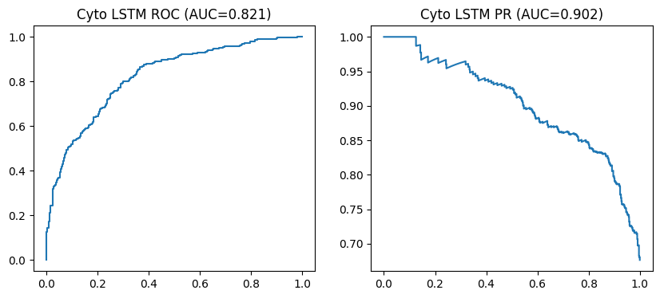

# 🧪 Chemical Toxicity Prediction (hERG & Cyto)

> Predicting whether chemical compounds are toxic using deep learning and deploying it as a simple app for testing.

---

## 💡 Project Idea
Drug discovery involves testing thousands of chemical compounds. Manually checking if a compound is **toxic** (harmful to human cells) is very expensive and time-consuming.

This project uses **machine learning and deep learning** to predict whether a compound is toxic by analyzing its chemical structure. We focused on two important toxicity types:  
- **hERG Toxicity** → cardiac (heart-related) toxicity  
- **Cytotoxicity (Cyto)** → general cell toxicity

---

## 📊 Dataset
- Source: [ChEMBL Database](https://www.ebi.ac.uk/chembl/)  
- Contains chemical compounds and toxicity labels.  
- Chemical SMILES strings were converted into features using **RDKit** (molecular fingerprints).

---

## 🔧 What I Did
1. **Data preprocessing:** cleaned SMILES, removed invalid rows, generated molecular fingerprints with RDKit.  
2. **Modeling:** trained classical ML baselines (Logistic Regression, Random Forest, SVM) and deep learning LSTM models using PyTorch. Separate models for hERG and Cyto.  
3. **Evaluation:** measured Accuracy, Precision, Recall, F1-score, ROC-AUC, PR-AUC and compared models.  
4. **Deployment:** built a simple app-like interface (Streamlit/Flask style) to input a SMILES string and return predicted hERG or Cyto toxicity using the trained model.

---

## 🔍 Results

**hERG LSTM**  
- Accuracy: **85.1%**  
- ROC-AUC: **0.805**  
- PR-AUC: **0.936**  
- High recall for toxic compounds (**~97%**)


**Cyto LSTM**  
- Accuracy: **78.9%**  
- ROC-AUC: **0.821**  
- PR-AUC: **0.902**



**Confusion Matrices & Reports**  
The confusion matrices and short classification summaries show model performance and class-level precision/recall.


---

## ✅ Key Takeaways
- LSTM-based deep models outperformed classical ML on these toxicity tasks.  
- hERG model is highly sensitive (detects most toxic compounds).  
- Cyto model shows good balance of precision and recall.  
- The deployed app demonstrates practical use: quick screening of compounds before lab testing.

---

## ⚙️ How to Run
Install the required libraries and open the notebook to reproduce experiments and run predictions:

```bash
pip install -r requirements.txt
jupyter notebook toxicity_model.ipynb
